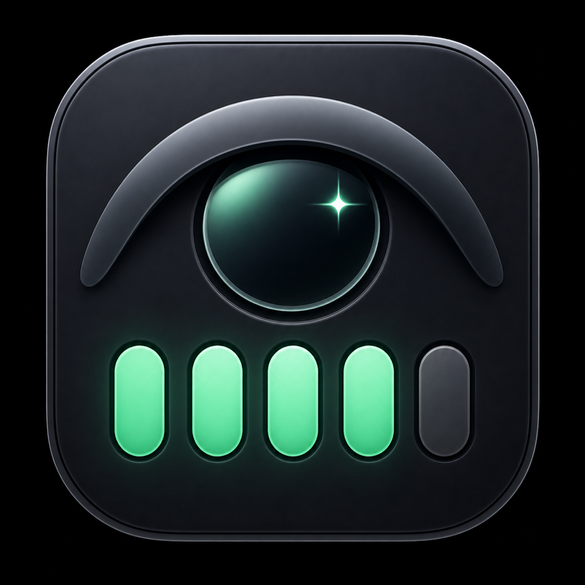
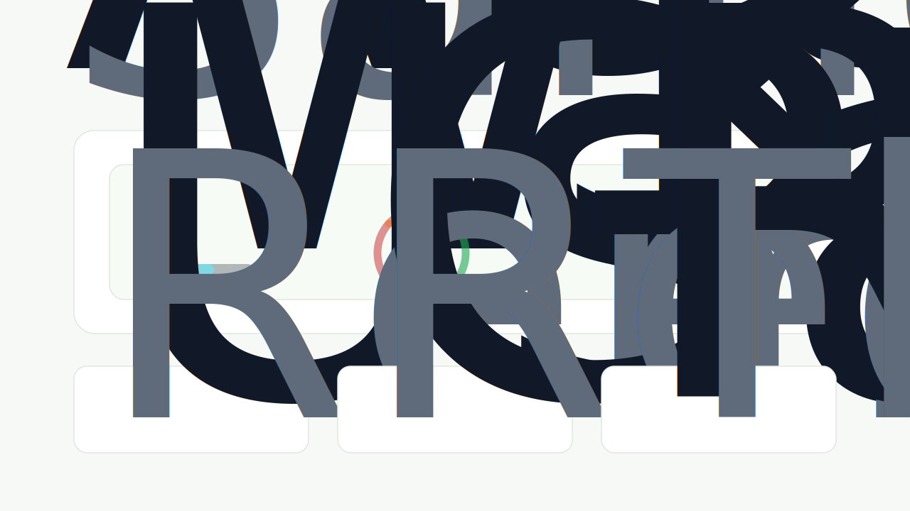

<p align="center">
  
</p>

<h1 align="center">CodexGlance</h1>

<p align="center">
  <strong>Codex usage at a glance. No clicks.</strong>
</p>

<p align="center">
  <a href="https://leoccino.github.io/CodexGlance/">Website</a>
  ·
  <a href="https://github.com/Leoccino/CodexGlance/releases">Download</a>
  ·
  <a href="https://github.com/Leoccino/CodexGlance">GitHub</a>
</p>

CodexGlance is a tiny macOS menu bar app for Codex users who only need one answer while working: how much usage is left right now.

<p align="center">
  
</p>

## Product Focus

CodexGlance is intentionally narrow:

- **Codex only:** built for people who use Codex and want a dedicated usage glance.
- **Menu bar only:** no dashboard to keep open, no extra account, no separate service.
- **Current window first:** the 5-hour Codex usage window is shown by default.
- **Weekly optional:** weekly usage can be added from the menu when you want it.

The menu bar item shows:

- `5h`: current 5-hour Codex usage window.
- `wk`: optional weekly Codex usage window.
- Percentage: remaining usage, rounded to whole numbers.
- Gauge: red for low remaining, orange for caution, green for healthy.
- Underline: time left before the current window resets.

Click the menu bar item to see account details, reset times, the last update time, and a manual refresh command.

## Visual Design

The public site and README use the same visual model as the macOS app: a 210 degree gauge start, 240 degree sweep, and a needle mapped to the remaining percentage.

<p align="center">
  
</p>

## Install

Download `CodexGlance.app.zip` from the latest [GitHub release](https://github.com/Leoccino/CodexGlance/releases), unzip it, and open `CodexGlance.app`.

Because the app is currently unsigned, macOS may require right-clicking the app and choosing `Open` the first time.

Requirements:

- macOS 13 or newer.
- ChatGPT or Codex installed and signed in locally.

## Privacy

CodexGlance reads usage from the local Codex app server. It does not ship tokens, cookies, prompts, or usage data to any third-party service.

## Build From Source

```sh
git clone https://github.com/Leoccino/CodexGlance.git
cd CodexGlance
./Scripts/package-app.sh
open .build/CodexGlance.app
```

For development, you can run it directly:

```sh
swift run CodexGlance
```

For a one-shot terminal check without starting the menu bar UI:

```sh
swift run CodexGlance -- --print
```

If SwiftPM cannot find the active macOS SDK, use the direct build script:

```sh
./Scripts/build.sh
.build/manual/CodexGlance
```

Create a release zip locally:

```sh
./Scripts/package-release.sh
```

CodexGlance reads usage from the local Codex app server:

1. Starts `codex app-server`.
2. Initializes JSON-RPC.
3. Calls `account/rateLimits/read`.
4. Calls `account/read` for account identity.

CodexGlance automatically finds the Codex executable bundled with either `ChatGPT.app` or `Codex.app`. Set `CODEX_BIN=/path/to/codex` only for a custom installation.

## Verify

```sh
swift test
swift build
./Scripts/build.sh
./Scripts/package-app.sh
```
